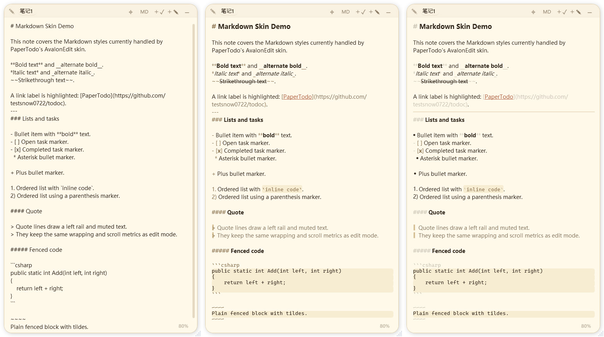

<h1 align="center">PaperTodo · 一张纸</h1>

<p align="center">
  <strong>让桌面上有几张安静、可用、不打扰人的纸。</strong><br>
  一个轻量、自由共创的 Windows 桌面便签。
</p>

<p align="center">
  
  
  
  
</p>
<p align="center">
  <a href="https://snownico0722.github.io/PaperTodo/">官方网站</a> ·
  <a href="https://github.com/snownico0722/PaperTodo/releases/latest">下载发布版</a> ·
  <a href="用户手册.md">用户手册</a> ·
  <a href="CHANGELOG.md">更新日志</a> ·
  <a href="https://qm.qq.com/q/Mp7spYLrig">QQ 交流群</a> 
</p>

<p align="center">
  <a href="README.en.md">English</a>
</p>

---

## 预览

| 纸片 |
| :---: |
|  |

| Markdown 浏览 |
| :---: |
|  |

| 胶囊模式 | 高级胶囊 |
| :---: | :---: |
|  |  |
| 纸片可折叠为小胶囊，减少桌面占用。 | 折叠胶囊自动贴到屏幕边缘，悬浮时滑出。 |

---

## 设计理念

- **纸片优先** — 每张纸都是独立窗口，直接常驻桌面，无需打开层级复杂的管理后台。
- **即时使用** — 想记就写，勾选即完；所有内容自动保存，操作路径极短。
- **无需管理** — 不刻意承载复杂的项目管理逻辑，降低日常记录的心智负担。
- **原生轻量** — 基于 WPF 原生开发，拒绝 Web 套壳，启动快速且资源占用低。
- **交互克制** — 界面干净低干扰，该安静时安静，需要时随时呼出。
> 拒绝长出非必要的交互层级和视觉焦点负担。

---

## 核心特性

### 1. 两种基础纸片
- **待办纸（Todo）**：清爽的任务清单。

- **笔记纸（Note）**：轻量 Markdown 与图文备忘。

  支持基础语法高亮与三档渲染强度；支持粘贴与拖入本地图片。

### 2. 边缘胶囊系统
- **折叠胶囊**：点击缩小可折叠为小胶囊，不占桌面空间，点击边缘即可重新展开。
- **自动贴边停靠**：折叠胶囊会自动停靠在屏幕边缘，鼠标悬停时平滑滑出。
- **多屏队列与主胶囊**：支持多显示器，拖动单个胶囊即可换边停靠或跨屏流动；边缘顶部的主胶囊可统筹收放整列入口，也可右键打开全局菜单。

### 3. 待办快速启动
- 从另一张展开纸片的顶栏拖出关联图标，或者直接将外部文件、文件夹拖入某个待办项，即可建立快速启动目标，后续点击图标一键直达。

### 4. 脚本胶囊
- 在笔记首行写入 `!p` 或 `!power`，便签即可转为 PowerShell 脚本运行器。左键点击胶囊直接执行脚本命令，右键可展开重新编辑。

### 5. 个性化与桌面集成
- **主题配色**：跟随系统、浅色、深色模式，内置暖纸、墨、林、霞四套配色方案。
- **排版定制**：支持系统默认字体与自定义字体文件（放置 `papertodo.ttf` 即可生效），支持字号与文字渲染平滑微调。
- **桌面与窗口**：适配 Windows 分屏贴靠；可选隐藏 Alt+Tab 与任务栏图标，让桌面更纯粹。
- **快捷调用**：支持自定义全局显隐与新建快捷键；提供命令行启动参数（如 `--show`, `--hide`, `--toggle`, `--new-todo`, `--new-note`, `--exit`），方便配合快捷键工具或脚本调用。

### 6. 本地自主与数据安全
- 所有纸片数据、图片与配置均保存在程序所在目录下（`data.json` 与 `note-assets.lmdb`），正常写盘前自动生成备份。

---

## 下载与运行

PaperTodo 为绿色单文件程序，无需安装。请在 [Releases 页面](https://github.com/snownico0722/PaperTodo/releases/latest) 下载对应版本：

- **`PaperTodo-...-self-contained.exe`（推荐）**：已内嵌 .NET 运行时，下载后双击即可直接运行。
- **`PaperTodo-...-no-runtime.exe`**：体积更小，适用于电脑已安装 .NET 10 Desktop Runtime (x64) 的环境。

> **提示**：建议将程序存放在有写入权限的专用目录（如 `D:\Apps\PaperTodo\`），请勿存放在只读目录或临时解压目录中。程序目录下放置 `PaperTodo.ico` 可作为自定义托盘图标。

首次运行后，纸片会出现在桌面上，托盘区会常驻 PaperTodo 图标。若纸片被遮挡或移出屏幕，**双击托盘图标**即可显示并拉回所有纸片。

---

## 详细文档与进阶

- 📖 **[完整用户手册](用户手册.md)**：包含新手 3 分钟入门指南、待办/笔记深度用法、多屏胶囊调度、全量设置项大字典、脚本编写规则、换机数据迁移教程及常见问题解答（FAQ）。
- 🧩 **[插件开发手册](plugin-samples/README.md)**：了解 PaperTodo 正文插件扩展机制、协议说明与示例索引。
- 📋 **[版本更新日志](CHANGELOG.md)**：查阅更新与修复记录。

---

## 构建与依赖

本地编译需 Windows 环境并安装 .NET 10 SDK：

```powershell
git clone --recurse-submodules https://github.com/snownico0722/PaperTodo.git
cd PaperTodo
dotnet build -c Release
```

如克隆时未拉取子模块，请先执行：

```powershell
git submodule update --init --recursive
dotnet build -c Release
```


---

## 反馈与交流

- 提交 Bug 或建议：[GitHub Issues](https://github.com/snownico0722/PaperTodo/issues)
- QQ 交流群：[551612664（奇奇怪怪的魔法研究基地）](https://qm.qq.com/q/Mp7spYLrig)

感谢 [linux.do](https://linux.do/) 社区的支持。
